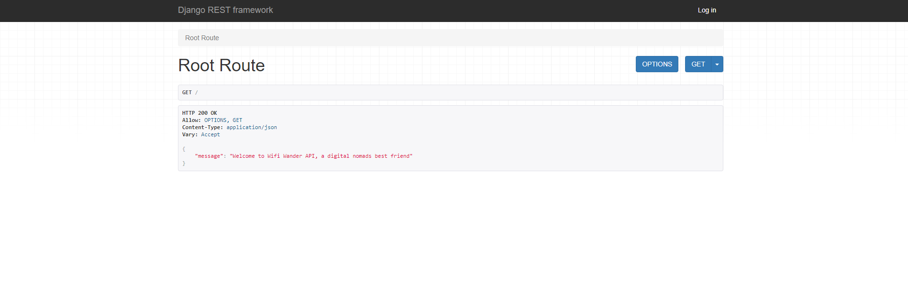
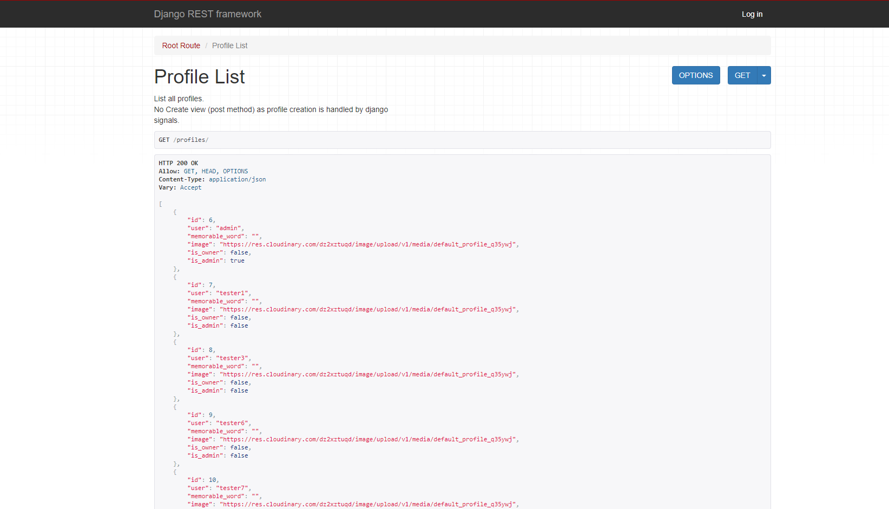
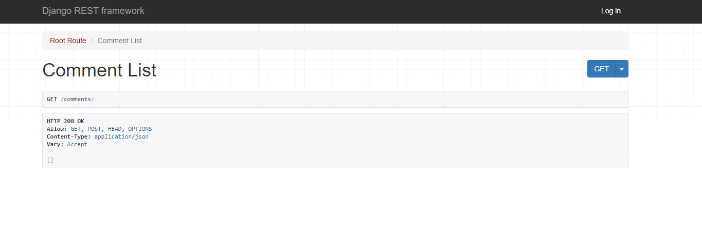
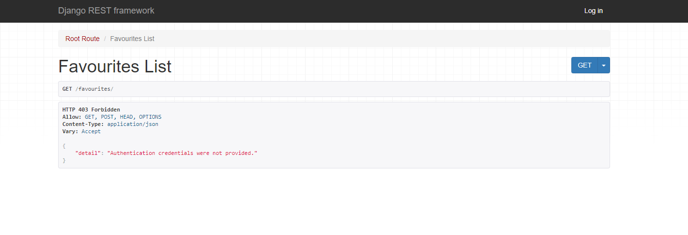
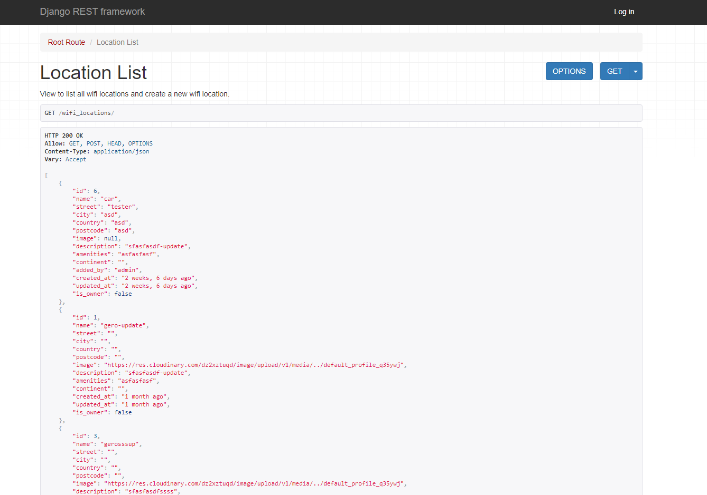

# Wifi Wander API

## Summary

- The Wifi Wander API is built using Django REST Framework and serves as the backend for Wifi Wander, a platform designed for digital nomads and remote workers seeking reliable internet connections while traveling. The frontend, developed using React, enables users to search for WiFi spots globally, add new WiFi locations, or review existing ones.

- Users can sign up, log in, and manage their profiles. They are allowed to add, update, or delete their own WiFi locations. Users can also post comments, rate WiFi spots, and engage with others by reviewing locations. Permissions ensure users can only modify or remove the content they created, maintaining site integrity and security.

- The API connects to a PostgreSQL database, storing user data, WiFi locations, reviews, and comments. It supports secure authentication, meaning only authenticated users can interact with protected areas. This setup ensures a smooth experience for users, enabling them to discover new WiFi locations, contribute to the community, and share insights on reliable workspaces worldwide.

[API Live Link](https://wifi-wander-api-835560a3f6c2.herokuapp.com/)

## Features

**Profile App**

**Comments App**

**Favourites App**

**Wifi Locations App**

## Permissions

The site implements authentication to restrict access to specific sections. General users cannot access all areas without an account, which is required to interact with particular features. This ensures that unauthorized users cannot modify or delete content they shouldn’t have access to.

Permissions are enforced using the `IsAuthenticated` class, restricting access to certain API endpoints. Users cannot edit or delete posts, comments, or other data they don’t own, which ensures that unauthorized actions trigger a 401 Unauthorized or 403 Forbidden response.

On the frontend, users with malicious intent are blocked from interacting with restricted content. Only logged-in users can create or edit content, helping protect the site's integrity by preventing unauthorized updates or deletions.

## Future Implementations

- Some features initially planned were not implemented. Future enhancements include:
  - **Favourites Notes**: Allowing users to add notes to their favourite WiFi locations.
  - **Two-Way Communication**: Enabling users to respond to comments.
  - **Updating Favourite Status**: Allowing users to change a WiFi location’s status from "planned" to "visited" after their visit.

## Credit and Content

**YouTube Courses:**

- **CodingEntrepreneurs** - Build a Django REST API with the Django Rest Framework. - [Link](https://www.youtube.com/watch?v=c708Nf0cHrs)
- **freeCodeCamp.org** - Django REST Framework Course – Build Web APIs with Python - [Link](https://www.youtube.com/watch?v=tujhGdn1EMI)

## For further details, including testing, database schema, and requirements, please refer to the front-end project's README.

- [Wifi Wander Frontend ReadMe.md](https://github.com/GMontaque/wifi-wander)
